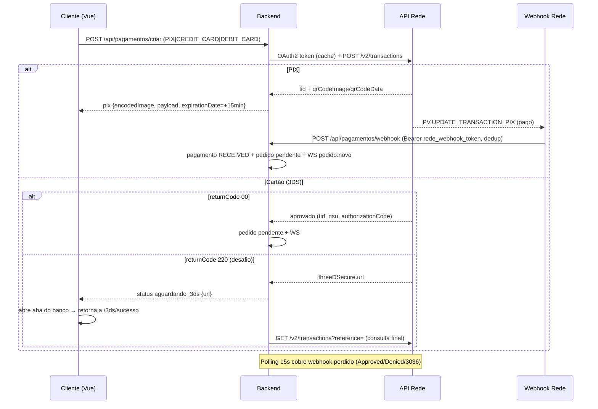

# Architecture — SaborExpress V2 / LoopFood

> Arquitetura atual do sistema. Atualizar a cada mudança em serviços, containers, banco, APIs, fluxos, integrações ou infra.

## Visão geral

```
{slug}.loopautomacoes.com.br (Router Nginx :8094)
├── /            → Cliente (Vue 3 SPA, :8091/80)
├── /admin       → Restaurante (Vue 3 SPA)
├── /entregador  → Entregador (Vue 3 SPA)
│
api :3001 (Backend Express — container, publicado também em :8090)
├── Módulos: auth, clientes, dashboard, entregadores, pagamentos, pedidos,
│            produtos, push, restaurante (banners)
├── Services: cep, frete, push, realtime, rede, pollingRede
├── Middleware: auth, errorHandler, pgContext, rateLimiter, tenantResolver
└── PostgreSQL 16 (86.48.18.22:5432/delivery) — RLS role-based

God (LoopFood Admin) :3002 — CRUD de tenants + credenciais Rede + transações
```

## Componentes

| Componente | Stack | Porta | Papel |
|---|---|---|---|
| **backend** | Node.js (ESM) + Express 4 | 3001 (publicado 8090) | API REST, WebSocket, polling, webhook Rede |
| **cliente** | Vue 3 + Vite | 8091 → nginx 80 | Cardápio, checkout, tracking (PWA) |
| **restaurante** | Vue 3 + Vite | via router | Painel admin (pedidos, PDV, KDS, relatórios) |
| **entregador** | Vue 3 + Vite | via router | App do entregador (PWA) |
| **router** | Nginx | 8094 | Entry point unificado por path |
| **god** | Node.js + Express + HTML estático | 3002 | Gestão de tenants/credenciais |
| **PostgreSQL** | 16 | 5432 (externo) | Fonte de dados única |

## Banco de dados (PostgreSQL)

- **Migrações**: `backend/migrations/*.sql` (001–027), executadas por `backend/src/migrate.js`.
- **Tabelas principais**: `restaurantes` (tenants, incl. `rede_*`, `jwt_secret`, `cor_*`, `features`, `logo_base64`, `config` JSONB), `clientes`, `entregadores`, `restaurante_users` (equipe/cargos), `produtos`, `categorias`, `produtos_extras`, `pedidos` (timeline/itens), `pagamentos`, `webhook_events`, `raios_entrega`, `mesas`, `banners`, `mensagens_pedido`.
- **Isolamento**: todas as tabelas têm `restaurant_id`; RLS role-based (`003/004_rls*.sql`).
- **Pagamentos (adaptada para Rede, migration 026)**: `payment_id` = tid Rede, `customer_id` nullable, campos `nsu`, `authorization_code`, `return_code`, `end_to_end_id`, `gateway`, `billing_type` (PIX/CREDIT_CARD/DEBIT_CARD), `status` (PENDING/RECEIVED/CONFIRMED/OVERDUE/REFUNDED/REFUND_IN_PROGRESS/REFUSED/CANCELLED).

## Integração de pagamento — API da Rede (e-Rede v2)

- **Autenticação**: OAuth2 client_credentials. `rede_client_id` (PV) + `rede_client_secret` (Chave de Integração) → Basic base64 → token (válido 24min, cache 20min).
- **Endpoints** (produção): token `POST api.userede.com.br/redelabs/oauth2/token` · negócio `https://api.userede.com.br/erede/v2/transactions`. Sandbox: `rl7-sandbox-api.useredecloud.com.br/oauth2/token` e `sandbox-erede.useredecloud.com.br/v2/transactions`.
- **Serviço**: `backend/src/services/rede.js` — token OAuth2 com cache, `criarTransacaoCartao`, `criarCobrancaPix`, `consultarTransacao`, `estornarTransacao`, build 3DS, validação de webhook, retry/backoff, conversão centavos.
- **Confirmação PIX**: webhook `PV.UPDATE_TRANSACTION_PIX` (`redeWebhookHandler.js`) + **polling de backup 15s** (`pollingRede.js`).
- **3DS v2**: Rede MPI embutido, frictionless-first; desafio → redirect para o banco (`returnCode 220` + `threeDSecure.url`), retorno via `threeDSecureSuccess`/`Failure`.
- **Estorno**: `POST /v2/transactions/{tid}/refunds` (manual, síncrono; códigos 359/360).

## Fluxo de comunicação (pagamento online)



## Autenticação

- JWT assinado com `restaurantes.jwt_secret` (por tenant); cookies httpOnly (`token`, `refreshToken`, `publicToken`).
- Login por **apelido** ou **telefone** (cliente/entregador) e **apelido** (equipe); bcrypt para senhas.
- Middleware `tenantResolver` resolve o tenant por subdomínio/header; `auth.js` valida JWT/role; `rateLimiter` protege login e webhook.

## Realtime

- `services/realtime.js` (socket.io): eventos de pedido novo/atualizado para cliente, restaurante e entregador.
- `services/push.js` (web-push): notificações push no navegador (PWA).

## Deploy / Infra

- Docker Compose: serviços `backend`, `cliente`, `router` (+ volumes `backend_uploads`). Restaurante/entregador servidos via router.
- Nginx em cada módulo: security headers, healthcheck; bloco TLS 1.2+ **comentado** (pendente habilitar com certificados — MELHORIA-001).
- Variáveis de ambiente: `DB_*`, `JWT_SECRET`, `RESTAURANT_ID`, `CORS_ORIGIN`, `UPLOAD_DIR`, `MAX_FILE_SIZE`. **Credenciais da Rede são por tenant no banco** (não em env).
